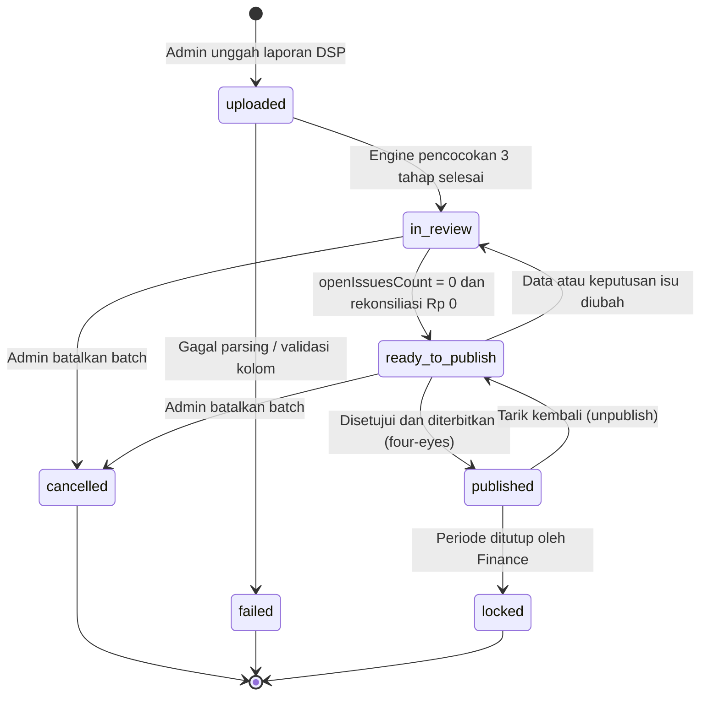

# PRD: Verifikasi & Otorisasi Publikasi Distribusi Royalti ke Akun Pencipta

| Informasi | Keterangan |
| --- | --- |
| **Status** | Ready for Review (v1.1, revisi dari v1.0) |
| **Tanggal** | 1 Oktober 2026 |
| **Modul** | Kontrol Batch, Otorisasi & Publikasi ke Akun Pencipta (*Staged Publishing Gatekeeper*) |
| **Prefix Kebutuhan** | **PB-** (sebelumnya FR-4, diganti karena bentrok dengan FR-4 "Kelola komposisi hak" di PRD Distribusi Royalti) |
| **Dokumen Terkait** | PRD Distribusi Royalti DSP per Member (pencocokan 3 tahap), PRD FR-3 Resolver |
| **Pengguna** | Tim Operasional & Hak Cipta, Tim Finance LOKA, Pencipta |
| **Pemangku Kepentingan** | Head of Royalty, Copyright Admin, Finance & Accounting, Product Engineering |

## Ringkasan Perubahan dari v1.0

| # | Perubahan | Bagian |
| --- | --- | --- |
| 1 | Prefix kebutuhan diganti dari FR-4 ke **PB-** agar tidak bentrok | Seluruh dokumen |
| 2 | State machine dirapikan: satu nama `published`, status `cancelled` masuk ke tipe data, `ready_to_publish` tidak lagi bersarang | 3, 5 |
| 3 | Definisi *issue* dan hitungan `openIssuesCount` dijelaskan, sehingga KPI G2 dan gatekeeper konsisten | 3.2, 4.2 |
| 4 | Cek komposisi hak melebihi 100% sekarang **memblokir** tombol | 4.2 |
| 5 | Ditambah persetujuan dua orang (*four-eyes*): penerbit tidak boleh sama dengan pengunggah/penyelesai isu | 4.3 |
| 6 | Aturan unpublish setelah pencipta sudah melihat atau mengunduh data | 4.4 |
| 7 | Unpublish mengembalikan batch ke `ready_to_publish`, bukan `in_review`; perubahan data otomatis membatalkan kesiapan | 3, 4.4 |
| 8 | Ditambah *snapshot checksum* agar data yang ditinjau sama dengan data yang diterbitkan | 4.3 |

---

## 1. Latar Belakang & Masalah

### 1.1 Kondisi Saat Ini

Saat Admin mengunggah laporan DSP (YouTube CMS, Spotify, Apple Music), sistem langsung menjalankan pencocokan 3 tahap (Asset ID DSP, IPBASE NO pencipta, Submitter Work ID / Song ID) dan menghitung distribusi. Akibatnya:

1. **Langsung terpapar ke pencipta.** Data muncul di Portal Pencipta dan mengubah saldo walau batch masih memiliki baris Unmatched, salah mapping, atau Konflik.
2. **Tidak ada tahap QA.** Tim Hak Cipta dan Finance tidak punya jeda untuk memverifikasi sebelum pencipta melihat angka.
3. **Risiko reputasi dan sengketa.** Jika admin mengoreksi atau membatalkan batch, saldo pencipta berubah mendadak dan memicu kecurigaan serta komplain.

### 1.2 Kondisi yang Diharapkan

Impor laporan dipisah dari penerbitan (*staged publishing*):

- Setelah unggah dan pemrosesan, batch berstatus `in_review` dan **hanya terlihat di dashboard internal**.
- **Portal Pencipta hanya menampilkan batch berstatus `published`.**
- Penerbitan memakai tombol **"Distribusikan ke Akun Pencipta"** yang dijaga *Pre-Publishing Checklist (Gatekeeper)* dan persetujuan dua orang.

---

## 2. Tujuan & KPI

| # | Tujuan | Metrik | Target |
| --- | --- | --- | --- |
| **G1** | Mencegah data royalti belum terverifikasi tampil ke pencipta | Insiden data non-`published` tampil di Portal Pencipta | **0 insiden** |
| **G2** | Memastikan semua isu terselesaikan sebelum rilis | Batch yang terbit dengan `openIssuesCount > 0` | **0%** (isu boleh berakhir `resolved`, `on_hold`, atau `ignored`, bukan `open`) |
| **G3** | Akurasi keuangan | Selisih rekonsiliasi | **Rp 0** |
| **G4** | Akuntabilitas | Aksi publikasi dan tarik kembali tercatat lengkap | **100% di Audit Log** |
| **G5** | Pengendalian internal | Batch terbit oleh orang yang sama dengan pengunggah atau penyelesai isu | **0%** (kecuali pengecualian yang disetujui, lihat 4.3) |

---

## 3. Siklus Hidup Batch



### 3.1 Definisi Status

| Status | Arti | Akses Pencipta |
| --- | --- | --- |
| `uploaded` | File diunggah dan struktur kolom divalidasi | Tersembunyi |
| `in_review` | Pencocokan selesai, masih ada isu `open` atau selisih rekonsiliasi | Tersembunyi |
| `ready_to_publish` | `openIssuesCount = 0`, selisih Rp 0, semua cek gatekeeper lolos | Tersembunyi |
| `published` | Diterbitkan; saldo, rincian lagu, dan slip royalti tampil di Portal Pencipta | **Terlihat** |
| `locked` | Periode ditutup Finance; tidak bisa diubah atau di-unpublish | Terlihat |
| `cancelled` | Dibatalkan sebelum terbit; tidak dihitung ke mana pun | Tersembunyi |
| `failed` | Gagal parsing atau validasi kolom | Tersembunyi |

Nama `distributed` dihapus; satu-satunya nama status terbit adalah `published`. Di UI label tetap boleh "Terdistribusi ke Pencipta".

### 3.2 Definisi Isu (Issue)

Setiap baris berstatus `unmatched` atau `conflict` (hasil pencocokan 3 tahap) memiliki status keputusan:

| Status isu | Arti | Dihitung di `openIssuesCount` |
| --- | --- | --- |
| `open` | Belum diputuskan | **Ya** |
| `resolved` | Diperbaiki di Resolver (Asset ID didaftarkan, IPBASE NO dilengkapi, Song ID dikoreksi) lalu terdistribusi | Tidak |
| `on_hold` | Sengaja ditahan untuk investigasi; **wajib alasan** | Tidak |
| `ignored` | Sengaja diabaikan, tidak didistribusikan; **wajib alasan** | Tidak |

`openIssuesCount` = jumlah baris `unmatched`/`conflict` yang berstatus isu `open`. Nominal `on_hold` dan `ignored` dilaporkan terpisah di rekonsiliasi dan di modal penerbitan.

**Aturan perubahan:** setiap perubahan data sumber, pemetaan, atau keputusan isu pada batch `ready_to_publish` otomatis mengembalikannya ke `in_review` dan menjalankan ulang gatekeeper.

---

## 4. Kebutuhan Fungsional

### 4.1 Isolasi Data Portal Pencipta

- **PB-1.1**: Fungsi agregasi royalti pencipta (`getCreatorsFromAllBatches` dan kalkulasi statement) **hanya membaca batch berstatus `published` dan `locked`**.
- **PB-1.2**: Jika ada batch periode berjalan yang masih `in_review` atau `ready_to_publish`, Portal Pencipta menampilkan banner: *"Laporan royalti periode \[Mei 2026\] sedang dalam tahap verifikasi & rekonsiliasi oleh Tim LOKA Publishing. Saldo akan diperbarui setelah proses verifikasi selesai."*
- **PB-1.3**: Dashboard Admin menampilkan tiga angka: Total Potensi Royalti (semua batch), Total Royalti Terpublikasi, dan Total Tertahan / Pending Publikasi.
- **PB-1.4**: Isolasi diterapkan di lapisan data (query dan API), bukan hanya di UI, sehingga data non-`published` tidak bisa terambil lewat endpoint pencipta.

### 4.2 Gatekeeper & Pre-Distribution Checklist

Tombol **"Distribusikan ke Akun Pencipta"** aktif hanya jika semua kriteria berikut lolos. Semua kriteria **memblokir**.

| Kriteria | Syarat Lolos | Jika Gagal |
| --- | --- | --- |
| **Isu terbuka** | `openIssuesCount == 0` | Tombol nonaktif. Tooltip: *"Masih ada X baris pengecualian yang belum diputuskan."* Arahkan ke Resolver. |
| **Alasan isu** | Setiap isu `on_hold` dan `ignored` punya alasan terisi | Tombol nonaktif; daftar isu tanpa alasan ditampilkan. |
| **Rekonsiliasi** | `Total Sumber − (Distribusi + OnHold + Ignored) = 0` | Tombol nonaktif; alert selisih merah. |
| **Komposisi hak** | Total persentase hak per lagu tepat 100% dan tidak melebihi 100% | Tombol nonaktif; daftar lagu over-split ditampilkan. |
| **Minimal satu penerima** | Ada minimal satu penerima hak dengan nominal > 0 | Batch kosong tidak dapat diterbitkan. |

### 4.3 Modal Konfirmasi & Persetujuan Dua Orang

**Layar ringkasan** memuat: nama batch dan DSP (mis. `YouTube CMS - Mei 2026`), total pendapatan DSP (bruto), total bagian pencipta, total bagian publisher (LOKA), jumlah pencipta penerima, jumlah lagu terdistribusi, nominal `on_hold`, nominal `ignored`, dan ringkasan alasannya.

**Checklist verifikasi:**

- Laporan telah melalui pencocokan 3 tahap.
- Rekonsiliasi balance (selisih Rp 0).
- Baris `on_hold` dan `ignored` terdokumentasi alasannya.

**Memo penerbitan** (opsional, disarankan).

**Persetujuan dua orang (*four-eyes*):**

- **PB-4.3.1**: Penerbit (approver) **tidak boleh sama** dengan pengunggah batch maupun pengguna yang menyelesaikan isu di Resolver pada batch tersebut.
- **PB-4.3.2**: Alur: Copyright Admin menandai batch siap, lalu approver yang berbeda (Finance atau Head of Royalty) membuka modal, memeriksa, dan menerbitkan.
- **PB-4.3.3**: Jika sistem mendeteksi penerbit sama dengan pengunggah atau penyelesai isu, tombol konfirmasi dinonaktifkan. Pengecualian hanya untuk Head of Royalty dengan alasan tertulis, dan dicatat di Audit Log.
- **PB-4.3.4**: Tombol "Konfirmasi & Terbitkan Distribusi" aktif setelah checkbox persetujuan dicentang: *"Saya telah memverifikasi data ini dan mengonfirmasi royalti akan diterbitkan ke akun pencipta."*

**Snapshot checksum:**

- **PB-4.3.5**: Saat modal dibuka, sistem menghitung checksum dari seluruh baris distribusi dan keputusan isu. Saat tombol konfirmasi ditekan, checksum dihitung ulang. Jika berbeda (ada perubahan di tengah jalan), penerbitan ditolak dan modal dimuat ulang. Checksum disimpan di Audit Log.

### 4.4 Tarik Kembali (Unpublish)

- **PB-4.4.1**: Hanya role Head of Royalty atau Finance yang dapat melakukan unpublish.
- **PB-4.4.2**: Syarat: batch belum `locked`, alasan wajib minimal 15 karakter.
- **PB-4.4.3**: **Dampak data:** status kembali ke `ready_to_publish` (data hasil verifikasi tetap utuh). Jika perlu koreksi, perubahan data akan otomatis memindahkannya ke `in_review` (aturan di 3.2). Data langsung ditarik dari Portal Pencipta dan saldo kembali ke kondisi sebelum batch terbit.
- **PB-4.4.4**: **Jika pencipta sudah berinteraksi dengan data:**
  - Sistem menampilkan di modal unpublish jumlah pencipta yang sudah melihat atau mengunduh slip royalti dari batch tersebut.
  - Jika batch sudah terkait pengajuan pencairan (payout), unpublish **diblokir** sampai Finance menyelesaikan atau membatalkan pengajuan tersebut.
  - Pencipta yang terdampak menerima notifikasi bahwa laporan periode tersebut sedang dikoreksi, dan slip yang pernah diunduh ditandai "dibatalkan / digantikan" pada versi berikutnya.
- **PB-4.4.5**: Unpublish dicatat sebagai *High Priority Event* di Audit Log.

### 4.5 Penempatan Komponen UI

1. **Riwayat Batch (`BatchHistory.tsx`)**: badge status dan tombol aksi per baris.

| Status | Badge | Tombol |
| --- | --- | --- |
| `in_review` | DRAFT / DALAM REVIEW (kuning, jam pasir) | "Periksa di Resolver" |
| `ready_to_publish` | SIAP DIDISTRIBUSIKAN (biru, centang) | "Distribusikan" |
| `published` | TERDISTRIBUSI KE PENCIPTA (hijau emerald) | "Lihat Detail Distribusi", menu "Tarik Kembali" |
| `locked` | TERKUNCI (abu-abu, gembok) | "Lihat Detail Distribusi" |
| `cancelled` / `failed` | DIBATALKAN / GAGAL (abu-abu / merah) | "Lihat Detail" |

2. **Resolver (`ExceptionResolver.tsx`)**: saat `openIssuesCount` menjadi 0 muncul banner *"Semua pengecualian selesai diselesaikan! Batch siap didistribusikan ke pencipta."* dengan tombol "Lanjutkan ke Distribusi". Isu `on_hold` dan `ignored` wajib mengisi alasan.
3. **Unggah (`UploadDistribution.tsx`)**: pesan sukses *"Laporan berhasil diimpor sebagai **Draft**. Laporan belum dikirimkan ke akun pencipta sampai Anda melakukan verifikasi dan publikasi."*

---

## 5. Data & Schema

### 5.1 Perubahan pada `RoyaltyBatch`

```typescript
export type BatchStatus =
  | 'uploaded'           // Baru diunggah, struktur divalidasi
  | 'in_review'          // Ada isu open / selisih rekonsiliasi
  | 'ready_to_publish'   // Bersih dan siap terbit
  | 'published'          // Sudah terbit ke akun pencipta
  | 'locked'             // Periode ditutup permanen
  | 'cancelled'          // Dibatalkan sebelum terbit
  | 'failed';            // Gagal parsing / validasi

export type IssueStatus = 'open' | 'resolved' | 'on_hold' | 'ignored';

export interface RoyaltyBatch {
  batchId: string;
  dspCode: DSPCode;
  period: string;
  fileName: string;
  status: BatchStatus;
  uploadedBy: string;          // untuk aturan four-eyes
  totalSource: number;
  totalDistributed: number;
  totalOnHold: number;
  totalIgnored: number;
  publisherShare: number;      // Bagian LOKA
  totalRows: number;
  matchedRows: number;
  unmatchedRows: number;
  conflictRows: number;
  openIssuesCount: number;     // unmatched/conflict dengan IssueStatus 'open'
  readyMarkedBy?: string;      // penanda siap (Copyright Admin)
  publishedAt?: string;
  publishedBy?: string;        // approver
  publishingNotes?: string;
  publishChecksum?: string;    // snapshot saat terbit
  unpublishedAt?: string;
  unpublishReason?: string;
  sourceRows: MatchedSourceRow[];
  distributions: DistributionResult[];
}
```

Setiap baris isu menyimpan `issueStatus`, `issueReason`, `resolvedBy`, dan `resolvedAt` (dipakai untuk aturan four-eyes).

### 5.2 Audit Log

| Aksi | Isi |
| --- | --- |
| `BATCH_READY_MARKED` | `{ batchId, actorId, timestamp }` |
| `BATCH_PUBLISHED` | `{ batchId, totalPayout, recipientCount, onHold, ignored, checksum, actorId, timestamp, notes }` |
| `BATCH_PUBLISH_OVERRIDE` | `{ batchId, actorId, reason, timestamp }` (pengecualian four-eyes) |
| `BATCH_UNPUBLISHED` | `{ batchId, reason, affectedCreators, actorId, timestamp }` (prioritas tinggi) |
| `BATCH_CANCELLED` | `{ batchId, reason, actorId, timestamp }` |

---

## 6. Rencana Implementasi Bertahap

| Fase | Tugas |
| --- | --- |
| **1. Engine & Data Model** | Update `BatchStatus` dan `IssueStatus`, hitung `openIssuesCount`, filter `getCreatorsFromAllBatches` hanya `published`/`locked`, update kalkulator rekonsiliasi |
| **2. UI Riwayat Batch** | Badge status baru, tombol aksi per status |
| **3. Gatekeeper & Modal** | Checklist, ringkasan nominal, four-eyes, snapshot checksum |
| **4. Unpublish & Audit Log** | Alur tarik kembali, deteksi interaksi pencipta, notifikasi, pencatatan audit |
| **5. Portal Pencipta** | Banner verifikasi, isolasi di lapisan data |
| **6. Uji End-to-End** | Unggah, cek portal (belum berubah), selesaikan isu, tandai siap, terbitkan oleh orang berbeda, cek portal, unpublish, cek portal kembali |

## 7. Kriteria Penerimaan

- Setelah unggah, Portal Pencipta tidak berubah sampai batch `published`.
- Tombol terbit nonaktif selama `openIssuesCount > 0`, selisih rekonsiliasi ≠ 0, atau ada lagu over-split.
- Isu `on_hold` atau `ignored` tanpa alasan menghalangi penerbitan.
- Pengguna yang mengunggah atau menyelesaikan isu tidak bisa menerbitkan batch yang sama (kecuali override Head of Royalty yang tercatat).
- Jika data berubah antara modal dibuka dan konfirmasi, penerbitan ditolak.
- Unpublish mengembalikan batch ke `ready_to_publish`, menarik data dari portal, dan mengirim notifikasi ke pencipta yang sudah melihat data.
- Unpublish diblokir pada batch `locked` atau batch yang sudah terkait pengajuan pencairan.
- Setiap aksi di 5.2 tercatat dengan aktor dan waktu.

## 8. Pertanyaan Terbuka

1. **Four-eyes:** apakah persetujuan dua orang diwajibkan untuk semua batch, atau hanya di atas ambang nominal tertentu?
2. **Pencairan (payout):** apakah modul pencairan sudah ada atau akan datang? Aturan PB-4.4.4 mengasumsikan payout terkait batch.
3. **Notifikasi pencipta:** saluran apa yang dipakai (email, in-app), dan siapa yang menyetujui isi pesannya?
4. **Close Period:** siapa yang berwenang menutup periode, dan apakah penutupan boleh dilakukan jika ada batch `on_hold` yang masih terbuka?
5. **Revisi file dari DSP:** jika DSP mengirim ulang laporan periode yang sama, apakah dibuat batch baru yang menggantikan batch lama, atau dilakukan unpublish dan unggah ulang?