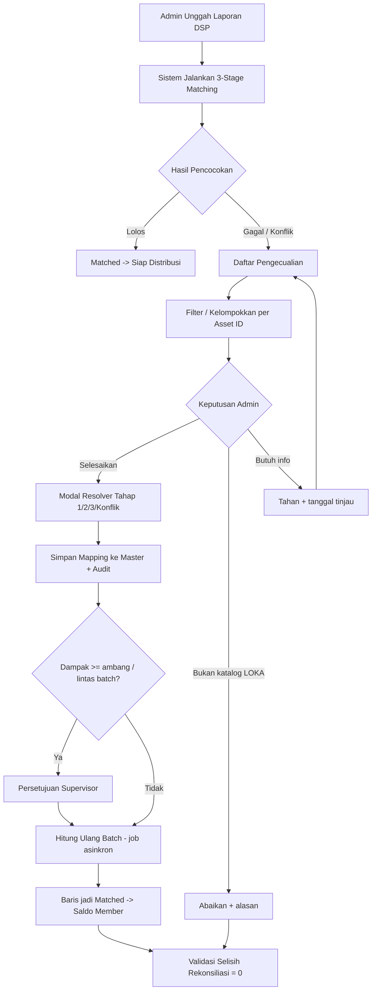

# PRD: Daftar Pengecualian & Resolver Baris "Unmatched / Konflik" (FR-3 & FR-3a)

| Informasi | Keterangan |
| --- | --- |
| **Status** | Draft v1.1 (revisi dari v1.0) |
| **Tanggal** | 1 Oktober 2026 |
| **Modul** | Modul Pengecualian & Resolver Pencocokan DSP (*Unmatched & Conflict Resolver*) |
| **Nomor Kebutuhan** | FR-3, FR-3a (Pengembangan Lanjutan dari PRD Distribusi Royalti LOKA) |
| **Target Pengguna** | Tim Operasional & Hak Cipta (*Copyright & Royalty Admin*) LOKA Publishing |
| **Pemilik Produk** | _(diisi)_ |
| **Pemangku Kepentingan** | Operasional, Hak Cipta, Keuangan, Engineering _(dikonfirmasi)_ |

### Ringkasan Perubahan dari v1.0

| # | Perubahan | Bagian |
| --- | --- | --- |
| 1 | Aturan keputusan matching 3 tahap didefinisikan eksplisit (urutan, prioritas badge, kasus satu kunci saja) | 4 |
| 2 | Peran Tahap 2 diperjelas (penentuan penerima royalti) termasuk kasus banyak penulis | 4 |
| 3 | Status baru: `ignored` (Bukan Katalog LOKA) dan `on_hold` (Ditahan), plus aturan aging & tutup periode | 5 |
| 4 | Resolusi massal per Asset ID unik dengan *backfill* ke baris/batch lain | 7.3, 7.6 |
| 5 | Fitur baru: tambah lagu dari modal, saran fuzzy + skor, undo, kelola master mapping, ekspor CSV | 7 |
| 6 | Kejelasan mata uang, cakupan (batch/periode), dan definisi metrik | 6, 7.1 |
| 7 | Hak akses, persetujuan (4-eyes), batch terkunci, konkurensi, audit trail lengkap | 8 |
| 8 | NFR performa & aksesibilitas, status UI (empty/loading/error) | 9, 7.7 |
| 9 | Metrik keberhasilan, *scope/out of scope*, prioritas, acceptance criteria, risiko, pertanyaan terbuka | 2, 3, 10-13 |
| 10 | Skema data dilengkapi (`song_dsp_asset`, `AuditLog`, kandidat konflik, dst.) | 14 |

---

## 1. Latar Belakang & Masalah

Dalam proses impor laporan royalti DSP (YouTube CMS, Spotify, Apple Music, dsb.), sebagian baris transaksi tidak dapat langsung didistribusikan karena gagal pada mekanisme **Pencocokan 3 Tahap**:

1. **Tahap 1 (DSP + Asset ID)**: Asset ID platform belum terpetakan ke lagu di database LOKA.
2. **Tahap 2 (Writers / IPBASE NO)**: Nama komposer/pencipta pada laporan berbeda penulisan (*string mismatch*) atau belum terhubung dengan `IPBASE NO` resmi member LOKA.
3. **Tahap 3 (Submitter Work ID / Song ID)**: Kode katalog (`Custom ID`) salah ketik, tertukar, atau tidak cocok dengan metadata publisher.
4. **Konflik**: Tahap 1 mengarah ke Lagu A, sedangkan Tahap 3 mengarah ke Lagu B.

### Masalah Saat Ini
Admin belum memiliki antarmuka terpadu untuk:
- Mengidentifikasi baris yang gagal beserta alasan kegagalan per tahap.
- Mengetahui total potensi pendapatan yang tertahan (*undistributed revenue*).
- Memperbaiki atau memetakan baris langsung di UI tanpa mengedit file Excel/CSV sumber.
- Menangani baris yang memang tidak dapat dicocokkan (mis. lagu bukan milik LOKA) sehingga rekonsiliasi tidak pernah tuntas.

---

## 2. Tujuan & Metrik Keberhasilan

| # | Tujuan | Metrik | Target (usulan) |
| --- | --- | --- | --- |
| G1 | **Transparansi pendapatan tertahan** secara *near real-time* | Kartu nominal tertahan akurat terhadap data batch | Selisih 0 terhadap query sumber |
| G2 | **Penyelesaian cepat** (1-2 klik per Asset ID/alias) | Waktu median menyelesaikan satu kasus | ≤ 60 detik |
| G3 | **Auto-learning mapping** | Penurunan jumlah baris unmatched batch berikutnya untuk DSP yang sama | ≥ 50% lebih rendah setelah 2 periode |
| G4 | **Kalkulasi ulang aman** | Keberhasilan *re-process* tanpa duplikasi | 100%, idempoten |
| G5 | **Kualitas matching** | Matching rate berbasis **nominal** (Rp) dan berbasis **jumlah baris** | ≥ 98% nominal per batch setelah resolusi |
| G6 | **Rekonsiliasi tuntas** | Batch dengan selisih 0 saat tutup periode | 100% (lihat aturan di bagian 5) |

---

## 3. Ruang Lingkup

**Dalam lingkup (In Scope)**
- Halaman daftar pengecualian, kartu ringkasan, tabel, filter, pencarian, sortir.
- Modal resolver untuk Tahap 1, 2, 3, dan Konflik.
- Status `ignored` dan `on_hold`.
- Resolusi massal per Asset ID, *backfill*, *auto-map*, *re-process batch*.
- Undo mapping, halaman kelola master alias & asset, ekspor CSV.
- Audit trail, hak akses, persetujuan.

**Di luar lingkup (Out of Scope) v1.1**
- Perubahan algoritma pencocokan inti selain yang didefinisikan di bagian 4.
- Penagihan ulang / klaim ke DSP atas baris yang ditolak.
- Pembayaran ke member (hanya memastikan saldo dan status rekonsiliasi benar).
- Pengelolaan katalog lagu penuh (hanya *quick-add* minimal dari modal).

**Prioritas (MoSCoW)**

| Prioritas | Fitur |
| --- | --- |
| **Must** | Kartu ringkasan, tabel + filter, modal Tahap 1/2/3/Konflik, re-process idempoten, audit trail, status `ignored`/`on_hold`, resolusi per Asset ID, hak akses |
| **Should** | *Backfill* lintas batch, saran fuzzy + skor, tambah lagu dari modal, undo, ekspor CSV, persetujuan 4-eyes |
| **Could** | Auto-map exact title massal, halaman kelola master (edit/hapus massal) |
| **Won't (v1.1)** | Integrasi klaim ulang ke DSP |

---

## 4. Aturan Keputusan Pencocokan (*Matching Decision Rules*)

> Bagian baru. Sebelumnya tidak terdefinisi dan menjadi sumber ambiguitas.

### 4.1. Dua tugas pencocokan
- **Resolusi Lagu** (Tahap 1 + Tahap 3): menentukan *lagu LOKA mana* yang dimaksud baris.
- **Resolusi Penerima** (Tahap 2): menentukan *member/pencipta mana* (`IPBASE NO`) yang berhak atas royalti dari lagu tersebut.

### 4.2. Tabel keputusan Resolusi Lagu

| Hasil Tahap 1 (Asset ID) | Hasil Tahap 3 (Custom ID) | Status | Keterangan |
| --- | --- | --- | --- |
| Ketemu Lagu A | Ketemu Lagu A | `matched` | Lolos, keyakinan tinggi |
| Ketemu Lagu A | Kosong / tidak ketemu | `matched` | Memakai kunci Tahap 1; ditandai `singleKeyMatch` |
| Tidak ketemu | Ketemu Lagu B | `matched` | Memakai kunci Tahap 3; sistem menyarankan mendaftarkan Asset ID ke `song_dsp_asset` |
| Ketemu Lagu A | Ketemu Lagu B (A ≠ B) | `conflict` | Perlu keputusan admin |
| Tidak ketemu | Tidak ketemu | `unmatched`, `failedStage = 1` | Tahap 3 juga dicatat gagal di `failureFlags` |

*(Asumsi: lolos dengan satu kunci yang valid dianggap `matched`. Lihat pertanyaan terbuka Q1.)*

### 4.3. Resolusi Penerima (Tahap 2)
- Tahap 2 hanya dievaluasi **setelah** lagu teridentifikasi.
- Setiap nama di `writers` dipecah (pemisah `,` `&` `/` `;` `dan`), dinormalisasi, lalu dicocokkan ke alias/`IPBASE NO`.
- Porsi royalti per penerima mengikuti **data split pada master lagu**, bukan dari string laporan. String laporan hanya dipakai untuk identifikasi/validasi.
- Jika **salah satu** nama gagal dipetakan, baris menjadi `unmatched` dengan `failedStage = 2`, dan modal menampilkan hanya nama yang belum dipetakan.
- Jika lagu belum memiliki data split, baris ditandai `failedStage = 2` dengan alasan "Split master belum tersedia".

### 4.4. Prioritas badge
Jika baris gagal di lebih dari satu tahap, badge menampilkan **tahap gagal paling awal** (1 → 2 → 3). Semua tahap gagal tersimpan di `failureFlags` dan tampil di panel detail.

### 4.5. Normalisasi alias
- Abaikan huruf besar/kecil, tanda baca, spasi ganda; `"T. Widayat"` = `"T Widayat"`.
- Alias berlaku **global** secara default; opsi "hanya untuk DSP ini" tersedia.
- Jika satu alias cocok ke lebih dari satu member, sistem **tidak** memetakan otomatis dan meminta admin memilih; pilihan disimpan.

---

## 5. Status Baris & Siklus Hidup

| Status | Arti | Masuk hitungan tertahan? |
| --- | --- | --- |
| `matched` | Lolos, siap/sudah didistribusikan | Tidak |
| `unmatched` | Gagal Tahap 1/2/3 | Ya |
| `conflict` | Kunci silang ke lagu berbeda | Ya |
| `on_hold` | Ditahan sementara (menunggu info/pihak lain), wajib alasan & tanggal tinjau ulang | Ya (kategori terpisah) |
| `ignored` | Bukan katalog LOKA / tidak didistribusikan, wajib alasan | Tidak, dicatat sebagai **pengecualian rekonsiliasi** |
| `resolved` | Sudah diselesaikan manual, menunggu *re-process* | Ya sampai re-process |

**Aturan rekonsiliasi (memperbaiki target "selisih = 0")**:

```
Total Sumber = Σ Matched + Σ Ignored + Σ On-hold + Σ Unmatched/Conflict
Selisih Rekonsiliasi = Total Sumber − (Σ Distribusi + Σ Ignored + Σ On-hold + Σ Unmatched/Conflict) = 0
```
Selisih harus selalu **0**. Yang berubah antarperiode adalah komposisi (perpindahan nominal dari *unmatched* ke *matched*/*ignored*), bukan hilangnya nominal.

**Aging & tutup periode**
- Baris `unmatched`/`conflict`/`on_hold` berumur > 30 hari diberi penanda "Menua" dan muncul di ringkasan.
- Saat tutup periode, baris yang masih terbuka wajib diputuskan: diselesaikan, `ignored`, atau diteruskan sebagai saldo tertahan ke periode berikutnya (dicatat eksplisit).

---

## 6. Kebijakan Mata Uang & Nominal

- **Nilai tampilan utama**: `idrRev` (Rupiah hasil konversi). `incomeRev` (mata uang asal) ditampilkan sebagai nilai sekunder beserta kode mata uang.
- Kartu "Nilai Royalti Tertahan" dan kolom tabel memakai `idrRev`; label kolom: **"Pendapatan (Rp)"**.
- Kurs yang dipakai mengikuti kurs saat impor batch (tidak dihitung ulang saat re-process).
- Istilah "kotor" hanya dipakai jika benar-benar gross; konfirmasi definisi dengan Keuangan (Q4).

---

## 7. Kebutuhan Fungsional

### 7.1. Ringkasan Pengecualian (*Exception Overview*)

**Cakupan data**: default **satu batch aktif**; filter **Batch/Periode** di atas halaman, dengan opsi "Semua batch terbuka".

Empat kartu:
1. **Total Baris Bermasalah**: jumlah `unmatched` + `conflict` (+ rincian kecil `on_hold`).
2. **Nilai Royalti Tertahan (Rp)**: Σ `idrRev` baris `unmatched`, `conflict`, `on_hold`, `resolved`(belum diproses).
3. **Breakdown Tahap Kegagalan** (baris **dan** Rp): Tahap 1, Tahap 2, Tahap 3, Konflik.
4. **Tingkat Keberhasilan Matching**: dua angka, berbasis **baris** dan berbasis **nominal**.

### 7.2. Tabel Daftar Pengecualian

**Mode tampilan (toggle)**
- **Per Baris**: satu baris = satu baris laporan.
- **Per Asset ID / Kasus Unik** (default untuk Tahap 1): mengelompokkan baris dengan Asset ID (atau alias penulis untuk Tahap 2) yang sama; menampilkan jumlah baris terdampak dan total Rp.

**Kolom**
- **#** nomor baris asli (atau jumlah baris pada mode kelompok).
- **DSP & Platform** ikon + label.
- **Data Mentah**: `Asset ID`, Judul Lagu, Writers, `Custom ID`.
- **Pendapatan (Rp)** (+ nilai asal & mata uang).
- **Status & Tahap Gagal** badge **warna + ikon + teks** (aman buta warna):
  - Merah ⛔ `Gagal Tahap 1: Asset ID Tidak Ditemukan`
  - Amber ⚠ `Gagal Tahap 2: Writer / IPBASE Tidak Dikenal`
  - Indigo ⓘ `Gagal Tahap 3: Custom ID Tidak Cocok`
  - Ungu ⇄ `Konflik: Kunci Mengarah ke Lagu Berbeda`
  - Abu-abu ⏸ `Ditahan` / ⊘ `Diabaikan`
- **Umur** (hari sejak impor) dan penanda "Menua".
- **Aksi**: **Selesaikan / Map**, **Tahan**, **Abaikan**.

**Fitur pendukung**
- **Filter**: Batch/Periode, DSP, jenis kegagalan, status, rentang nominal, umur.
- **Pencarian**: judul lagu, nama penulis, Asset ID, Custom ID.
- **Sortir**: default nominal tertinggi → terendah; dapat diubah.
- **Paginasi, filter, dan sortir di sisi server** (lihat NFR).
- **Ekspor CSV** sesuai filter aktif (termasuk alasan kegagalan).
- **Seleksi massal** (centang) untuk aksi Tahan/Abaikan/Auto-map.

### 7.3. Modal Resolver

Setiap modal menampilkan **panel dampak**: "Keputusan ini berlaku ke **N baris** senilai **Rp X** (batch ini: a, batch lain: b)". Terdapat pengaturan **Cakupan**: *hanya baris ini* / *semua baris dengan kunci sama di batch ini* / *semua batch terbuka* (default, dengan *backfill*).

**A. Gagal Tahap 1 (Asset ID belum terdaftar)**
- Konteks: Asset ID, DSP, judul di DSP.
- Input: dropdown lagu katalog LOKA (cari judul/Custom ID), dengan **saran kandidat + skor keyakinan** (fuzzy judul & penulis); tombol **"Lagu belum ada? Tambah lagu baru"** (formulir minimal: judul, Custom ID, penulis & split).
- Opsi: ☑ *Simpan Asset ID secara permanen* (default aktif).
- Hasil: menulis baris ke `song_dsp_asset`; semua baris ber-Asset ID sama pada cakupan terpilih menjadi `resolved`.

**B. Gagal Tahap 2 (Writer mismatch)**
- Konteks: nama writer mentah; jika baris punya banyak penulis, hanya nama yang belum terpetakan yang dibahas satu per satu.
- Input: dropdown member komposer (Nama Resmi + `IPBASE NO`) dengan saran fuzzy.
- Opsi: ☑ *Tambahkan sebagai alias resmi*; ◻ *Hanya untuk DSP ini*.
- Hasil: menulis `writer_alias`; validasi bentrok alias (lihat 4.5).

**C. Gagal Tahap 3 (Custom ID tidak cocok)**
- Konteks: Custom ID di laporan dan kandidat terdekat.
- Input: koreksi Custom ID **atau** pilih lagu dari katalog.
- Opsi: ☑ *Simpan sebagai alias Custom ID untuk lagu ini* (default nonaktif; tanpa ini berlaku hanya pada baris/cakupan terpilih sebagai **override tingkat baris**).
- Hasil: memperbaiki mapping lagu baris.

**D. Konflik (kunci silang)**
- Panel berdampingan: Lagu A (via Asset ID) vs Lagu B (via Custom ID), menampilkan judul, penulis, split, dan Asset ID/Custom ID terkait.
- Keputusan (radio): *Gunakan Lagu A* / *Gunakan Lagu B* / *Pilih lagu lain*.
- Opsi koreksi sumber: ☑ *Perbaiki master yang salah* (mis. hapus/ubah `song_dsp_asset` yang mengarah ke lagu keliru). Jika tidak dicentang, hanya override tingkat baris/cakupan.
- Wajib mengisi **alasan** singkat.

### 7.4. Aksi Tahan & Abaikan
- **Tahan**: wajib alasan + tanggal tinjau ulang; baris tetap masuk nilai tertahan (kategori "Ditahan").
- **Abaikan ("Bukan Katalog LOKA")**: wajib alasan; nominal dipindah ke pengecualian rekonsiliasi; dapat dikembalikan (undo).
- Aksi massal tersedia dan dapat dikelompokkan per Asset ID.

### 7.5. Saran Otomatis & Auto-Map
- **Saran fuzzy**: menampilkan hingga 5 kandidat dengan skor (judul, penulis, durasi bila ada).
- **Auto-Map Exact Title**: hanya menyarankan pemetaan jika **tepat satu** lagu katalog cocok 100% (judul + minimal satu penulis cocok). Jika ≥ 2 kandidat (cover/versi lain), baris **tidak** di-auto-map dan ditandai "Ambigu". Selalu melalui layar konfirmasi admin berisi pratinjau dampak.

### 7.6. Backfill & Hitung Ulang Batch
- **Backfill**: mapping baru otomatis diterapkan ke baris `unmatched` di batch lain yang masih terbuka (bukan batch terkunci/dibayar).
- **Hitung Ulang Batch** dijalankan sebagai **job asinkron**: menampilkan progres, dapat ditinggalkan, dan memberi notifikasi saat selesai. Hasil akhirnya (status baris, saldo 70:30, rekonsiliasi) **dimutakhirkan segera setelah job selesai**; selama job berjalan, angka ditandai "sedang dihitung".
- Re-process hanya menyentuh baris berstatus `resolved`; baris `matched` yang sudah terdistribusi tidak dihitung ulang (idempoten).

### 7.7. Undo & Kelola Master Mapping
- **Undo**: tiap penyelesaian dapat dibatalkan selama batch belum terkunci; membatalkan juga mapping master yang dibuat olehnya (dengan pratinjau dampak).
- **Halaman Kelola Mapping**: daftar `song_dsp_asset`, alias writer, alias Custom ID; dapat dicari, diubah, dinonaktifkan, dan dilihat riwayatnya. Perubahan mapping menampilkan jumlah baris historis yang terdampak.

### 7.8. Status Antarmuka
- **Empty state**: "Tidak ada pengecualian" dengan ringkasan batch berhasil 100%.
- **Loading**: skeleton untuk kartu dan tabel.
- **Error**: pesan jelas + tombol coba lagi; kegagalan job re-process menampilkan baris penyebab.
- **Konfirmasi**: aksi berdampak besar (backfill, abaikan massal) memerlukan dialog konfirmasi.

---

## 8. Hak Akses, Persetujuan & Integritas Proses

### 8.1. Peran
| Peran | Lihat | Resolve | Tahan/Abaikan | Re-process | Setujui | Kelola Master |
| --- | :-: | :-: | :-: | :-: | :-: | :-: |
| Viewer (Keuangan) | ✔ | | | | | |
| Copyright & Royalty Admin | ✔ | ✔ | ✔ | ✔ | | ✔ (terbatas) |
| Supervisor | ✔ | ✔ | ✔ | ✔ | ✔ | ✔ |

### 8.2. Persetujuan (4-eyes)
Penyelesaian dengan dampak ≥ **ambang nominal** (usulan Rp 10.000.000) atau *backfill* lintas batch, serta aksi Abaikan massal, memerlukan persetujuan Supervisor sebelum *re-process*. Penyelesai dan penyetuju tidak boleh orang yang sama.

### 8.3. Batch terkunci / sudah dibayar
- Batch berstatus terkunci **tidak** dapat di-*re-process*.
- Mapping yang ditemukan terlambat diterapkan sebagai **penyesuaian (*adjustment*)** pada periode berjalan, tidak mengubah angka batch lama; tercatat terhubung ke batch asal.

### 8.4. Konkurensi
- Saat admin membuka modal, baris/kelompok dikunci lunak (*soft lock*) dengan indikator "Sedang diproses oleh [nama]" (kedaluwarsa 10 menit).
- Penyimpanan memakai *optimistic locking* (versi baris); konflik menampilkan pesan dan data terbaru.

### 8.5. Audit Trail
Setiap aksi mencatat: ID admin, *timestamp*, jenis aksi, baris/mapping terkait, **nilai sebelum & sesudah**, **alasan** (wajib untuk Konflik, Tahan, Abaikan, Undo), ID persetujuan bila ada. Log bersifat *append-only* dan dapat diekspor.

---

## 9. Kebutuhan Non-Fungsional

1. **Idempoten & aman**: perbaikan dan *re-process* tidak menduplikasi hasil distribusi (kunci idempotensi per `rowId` + versi mapping).
2. **Preservasi nilai**: selisih rekonsiliasi = 0 sesuai rumus di bagian 5; tervalidasi otomatis setelah tiap *re-process*.
3. **Performa**: mendukung batch ≥ 500.000 baris; tabel dimuat dengan paginasi sisi server (maks 100 baris/halaman), respons filter/sortir P95 ≤ 2 detik; *re-process* 100.000 baris ≤ 5 menit (target, divalidasi Engineering).
4. **Aksesibilitas**: kontras sesuai WCAG 2.1 AA; status tidak hanya dibedakan warna; navigasi keyboard pada tabel dan modal.
5. **Keamanan**: kontrol akses berbasis peran; data alias/IPBASE tidak diekspos ke peran Viewer kecuali diperlukan.
6. **Keandalan**: job *re-process* dapat dilanjutkan (*resumable*) bila terputus.
7. **Observabilitas**: metrik matching rate, waktu penyelesaian, dan kegagalan job tercatat.

---

## 10. Alur Kerja Pengguna



---

## 11. Acceptance Criteria (Ringkas)

| ID | Kriteria |
| --- | --- |
| AC-1 | Diberikan batch dengan baris gagal, kartu menampilkan jumlah baris dan Rp per tahap yang sama persis dengan hasil query sumber. |
| AC-2 | Baris gagal Tahap 1 dan 3 sekaligus menampilkan badge Tahap 1 dan `failureFlags` memuat keduanya. |
| AC-3 | Memetakan satu Asset ID dengan cakupan "semua batch terbuka" mengubah seluruh baris ber-Asset ID sama menjadi `resolved`, dan jumlah/Rp yang ditampilkan di panel dampak sama dengan hasil akhir. |
| AC-4 | Alias writer yang cocok ke >1 member tidak dipetakan otomatis dan meminta pilihan admin. |
| AC-5 | Jalankan *re-process* dua kali berturut-turut menghasilkan distribusi identik (tanpa duplikasi). |
| AC-6 | Setelah semua baris diselesaikan/ditahan/diabaikan, selisih rekonsiliasi = 0. |
| AC-7 | Konflik tidak dapat disimpan tanpa alasan; audit log memuat nilai sebelum & sesudah. |
| AC-8 | Penyelesaian di atas ambang nominal tidak dapat di-*re-process* sebelum disetujui Supervisor (bukan penyelesai). |
| AC-9 | Batch terkunci menolak *re-process* dan menawarkan *adjustment* pada periode berjalan. |
| AC-10 | Dua admin menyimpan baris yang sama: yang kedua menerima pesan konflik versi. |
| AC-11 | *Auto-map exact title* tidak menyarankan pemetaan untuk judul dengan ≥ 2 kandidat katalog. |
| AC-12 | Undo mengembalikan status baris dan mapping master ke kondisi sebelum penyelesaian. |
| AC-13 | Ekspor CSV memuat hanya baris sesuai filter aktif dan kolom alasan kegagalan. |

---

## 12. Dependensi, Risiko & Mitigasi

| Risiko | Dampak | Mitigasi |
| --- | --- | --- |
| Mapping salah tersimpan permanen (*auto-learning*) | Kesalahan royalti berulang lintas periode | Undo, halaman kelola master, persetujuan nominal tinggi, pratinjau dampak |
| Alias ambigu (nama sama beda member) | Royalti salah penerima | Tidak auto-map; wajib pilih admin; opsi per DSP |
| Laporan berukuran sangat besar | Lambat/time-out | Paginasi server, job asinkron, indeks pada Asset ID/Custom ID |
| Baris menggantung tanpa ujung | Rekonsiliasi tak tuntas | Status `ignored`/`on_hold`, aging, aturan tutup periode |
| Re-process pada batch terbayar | Selisih pembayaran | Kunci batch + mekanisme *adjustment* |
| Kurs/mata uang tidak konsisten | Nominal tertahan keliru | Kebijakan bagian 6, kurs dikunci saat impor |

**Dependensi**: modul matching 3 tahap, tabel `song_dsp_asset`, master member & `IPBASE NO`, modul distribusi 70:30, modul rekonsiliasi batch, sistem autentikasi/peran.

---

## 13. Pertanyaan Terbuka (Perlu Konfirmasi)

| # | Pertanyaan | Asumsi sementara di dokumen ini |
| --- | --- | --- |
| Q1 | Apakah cocok dengan satu kunci (Asset ID atau Custom ID saja) sudah cukup sebagai `matched`? | Ya, ditandai `singleKeyMatch` |
| Q2 | Apakah porsi royalti selalu dari split master lagu, bukan dari string writers laporan? | Ya |
| Q3 | Ambang nominal persetujuan 4-eyes | Rp 10.000.000 |
| Q4 | Definisi "Pendapatan Kotor" vs `incomeRev`/`idrRev` | Memakai `idrRev` |
| Q5 | Batas aging sebelum baris ditandai menua | 30 hari |
| Q6 | Apakah alias writer berlaku global atau per DSP secara default? | Global, opsi per DSP |
| Q7 | Apakah *quick-add* lagu dari modal boleh dilakukan Admin atau hanya Supervisor? | Admin, dengan audit |
| Q8 | Perlakuan baris `on_hold`/unmatched saat tutup periode (diteruskan vs dibayar ke akun penampung)? | Diteruskan sebagai saldo tertahan |

---

## 14. Model Data Penunjang (*Schema Reference*)

```typescript
// Status & tahap
export type MatchStatus =
  | 'matched' | 'unmatched' | 'conflict'
  | 'on_hold' | 'ignored' | 'resolved';
export type FailedStage = 1 | 2 | 3 | null;
export type ResolutionType =
  | 'manual_asset' | 'manual_alias' | 'manual_customid'
  | 'conflict_override' | 'auto_map' | 'backfill';
export type ResolutionScope = 'row' | 'batch' | 'all_open_batches';

// Baris laporan sumber yang dievaluasi
export interface MatchedSourceRow {
  rowId: string;
  batchId: string;
  dsp: string;                       // baru
  originalRow: {
    rowIndex: number;
    assetId: string;
    customId: string;
    writers: string;
    songTitle?: string;
    incomeRev: number;               // nilai mata uang asal
    currency: string;                // baru
    idrRev: number;                  // dipakai untuk tampilan & agregasi
    country: string;
    rightType: string;
  };
  matchStatus: MatchStatus;
  failedStage: FailedStage;          // tahap gagal paling awal (untuk badge)
  failureFlags: (1 | 2 | 3)[];       // baru: semua tahap gagal
  failureReason: string;
  matchedSongId: string | null;
  candidateSongIdByAsset?: string | null;     // baru: untuk panel konflik
  candidateSongIdByCustomId?: string | null;  // baru
  singleKeyMatch?: boolean;                    // baru
  unmappedWriters?: string[];                  // baru: nama yg belum terpetakan
  // penyelesaian
  resolutionType?: ResolutionType;
  resolutionScope?: ResolutionScope;
  rowLevelOverride?: boolean;        // true bila tidak disimpan permanen
  resolutionReason?: string;
  resolvedAt?: string;
  resolvedBy?: string;
  approvedBy?: string;
  holdUntil?: string;                // untuk on_hold
  version: number;                   // optimistic locking
}

// Master asset DSP -> lagu
export interface SongDspAsset {
  id: string;
  dsp: string;
  assetId: string;
  songId: string;
  active: boolean;
  createdBy: string;
  createdAt: string;
  sourceRowId?: string;
}

// Alias penulis
export interface WriterAliasMapping {
  id: string;
  rawWriterName: string;
  normalizedName: string;
  ipbaseNo: string;
  ipName: string;
  dsp?: string | null;               // null = global
  active: boolean;
  createdBy: string;
  createdAt: string;
}

// Audit trail (append-only)
export interface AuditLog {
  id: string;
  actorId: string;
  timestamp: string;
  action: 'resolve' | 'hold' | 'ignore' | 'undo' | 'approve'
        | 'reprocess' | 'mapping_edit' | 'auto_map' | 'backfill';
  targetType: 'row' | 'song_dsp_asset' | 'writer_alias';
  targetId: string;
  before: unknown;
  after: unknown;
  reason?: string;
  approvalId?: string;
  batchId?: string;
}
```
